# Airship Battles

Airship Battles is a project created as part of the Code Institute Full-stack development program: Python Essentials - Project 3.   This project offers an exciting gaming experience centered around airship battles. Whether you're a fan of aerial adventures or gaming enthusiasts, Airship Battles is sure to captivate you with thrilling battles in the sky.

Visit the live site [Here.](https://pp3-airship.herokuapp.com/)

---

## CONTENTS

* [Project Overview](#project-overview)
  * [Project Goals](#project-goals)

* [User Experience](#user-experience)
  * [User Expectations](#user-expectations)
  * [User Stories](#user-stories)

* [Design](#design)
  * [Colour Scheme](#colour-scheme)
  * [Imagery](#imagery)
  * [Structure](#structure)

* [Features](#features)
  * [Intro](#intro)
  * [Name input](#name-input)
  * [Guide](#guide)
  * [Quiz](#quiz)
  * [More knowledge](#more-knowledge)
  * [Quiz end messages](#quiz-end-messages)
  * [Leaderboard update message and display](#leaderboard-update-message-and-display)
  * [Quiz replay](#quiz-replay)
  * [Secret username](#secret-username)
  * [Front-end features](#front-end-features)

* [Future Implementations](#future-implementations)

* [Technologies Used](#technologies-used)
  * [Languages Used](#languages-used)
  * [Programs Used](#programs-used)

* [Deployment](#deployment)

* [Testing](#testing)

* [Credits](#credits)
  * [Code used and adapted](#code-used-and-adapted)
  * [Acknowledgments](#acknowledgments)

---

## **Project Overview**

I've been contemplating the 'Airship Battles' concept ever since I started the Code Institute Full-stack development program. When I finished the Python lessons, I was determined to turn this idea into a tangible project. I kicked off the project by creating wireframes and a flowchart to outline the gameplay and design.

The decision to dedicate this project was inspired by the themes of Final Fantasy airships, a beloved and iconic element of the Final Fantasy series.

"Airship Battles" stands out as a gaming project with a distinct set of features:

- **Error Checking Throughout**: The game is designed with robust error checking to ensure a smooth and seamless gaming experience.

- **Feedback on Every Input**: Players receive informative feedback for every action they take, whether it's the correct move or not, enhancing the learning process.

- **Evenly Spaced Text**: Text within the game is thoughtfully arranged to provide a visually pleasing and organized reading experience.

- **Typewriter-Style Text Output**: Enjoy an immersive typewriter-style text presentation, contributing to the overall atmosphere of the game.

- **Automatic Restart**: Begin a new game without needing to use a mouse at the end of the game.

- **Simplicity and Relaxation**: Immerse yourself in a straightforward and relaxing space-themed webpage, complementing the overall gaming experience.

These features were meticulously planned, with some being part of the initial project design (error checking and feedback), while others evolved organically as the project expanded in scope. The final result is a blend of elements aimed at delivering a captivating, enjoyable, and educational gaming experience.

### **Project Goals**

 - Create a command-line interface (CLI) game for airship battles using Python.
 - Design the game with a clear and intuitive interface.
 - Ensure an excellent user experience by focusing on layout, color schemes, and interaction.
 - Write reliable Python code, free from bugs and issues

[Back to top ⇧](#airship-battles)

---

## **User Experience**

### **User Expectations**

 - Easily understand the game's objective and mechanics.
 - Receive feedback for every interaction within the game.
 - Receive hints when facing challenges.
 - Access more information about ships damage, turns left, and outcomes (win, lose or out of turns).
 - Have the opportunity to add their name to the game.
 - Enjoy an appealing and thematically consistent visual design.
 - Encounter no errors or issues with the game's logic.

### **User Stories**

 - I want to have a nice background.
 - I want to have a username.
 - I want to be able to choose my grid.
 - I want to be able to see my name on the board.
 - I want to be shown help messages showing instructions.
 - I want to know more about the results of my selection.
 - I want to restart the quiz after finish playing.
 - I want no bugs or issues with the game.

[Back to top ⇧](#airship-battles)

---

## **Design**

### **Colour Scheme**

In the Airship Battles, the primary color is white, serving as the default for text. The ASCII image of the airship is red to enhance the theme, while answers and interactions maintain a plain and uncolored design for clarity and focus.

### **Imagery**

The Airship Battles features a simple design with a vast background picture, primarily designed to provide an immersive backdrop that complements the terminal game. This background picture serves to create a thematic atmosphere for the game, allowing players to focus on the CLI-based gaming experience without distractions.

 - Airships on the background
  

 

### **Structure**
 

The initial flowchart for the project was created at the project's inception. While the project generally adhered to the flowchart, there were some modifications made along the way to enhance the overall user experience (UX).

Flowchart Diagram

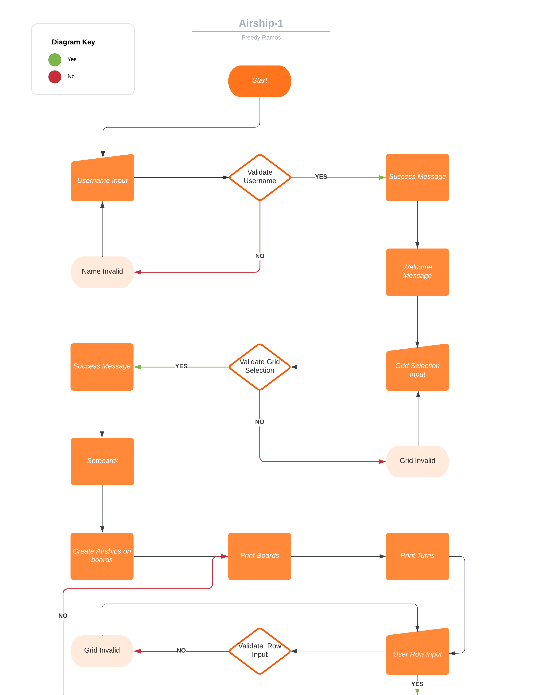
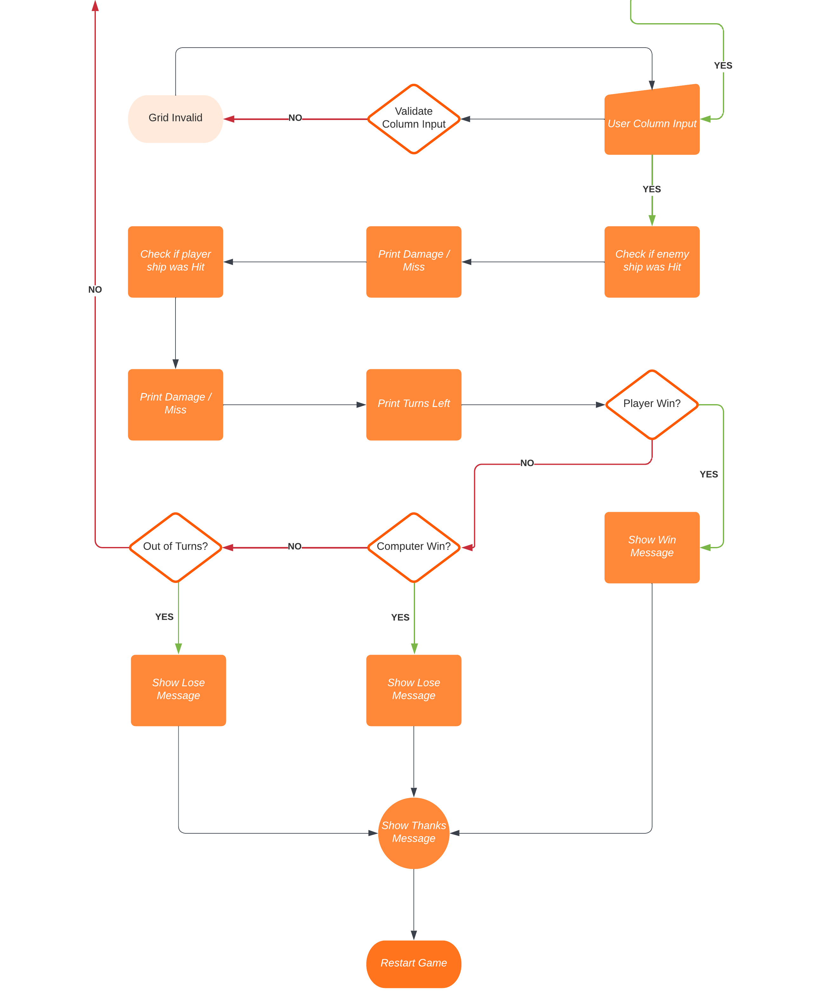

 

## **Features**

### **Background**
 - Background image showing a warship battle.
  

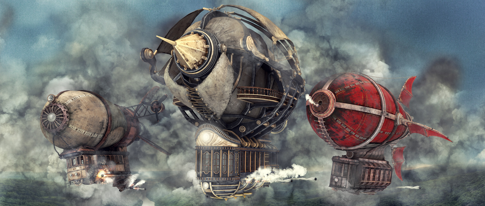
 

### **Name input**
 - Name input validation, success message, capitalize name.
  

 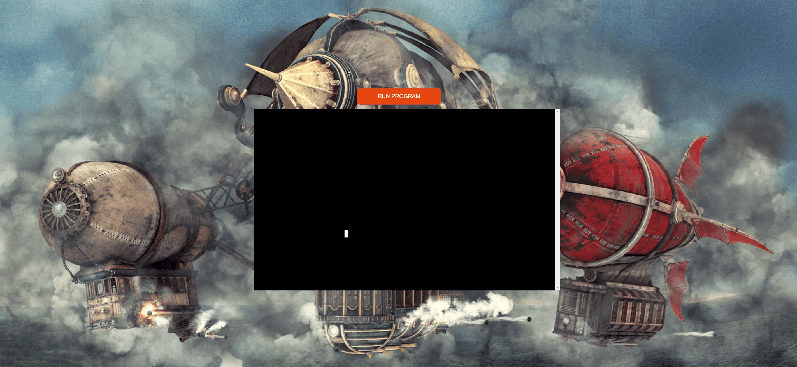
 
 - Name input validation, error message.
  

 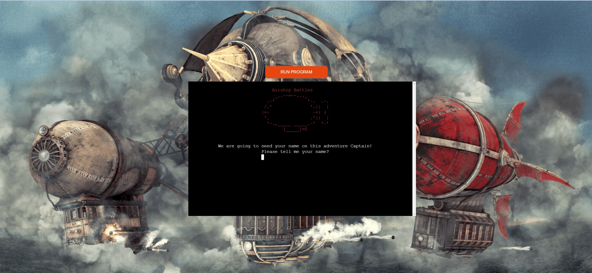

### **Grid Selection**
 - Option to select a grid between 4 or 6 squares, with validation and help messages and success message.
  

 

### **Board**
 - Show Enemy board, Player Board with name input, Turns left and column and row input with error messages.
  

 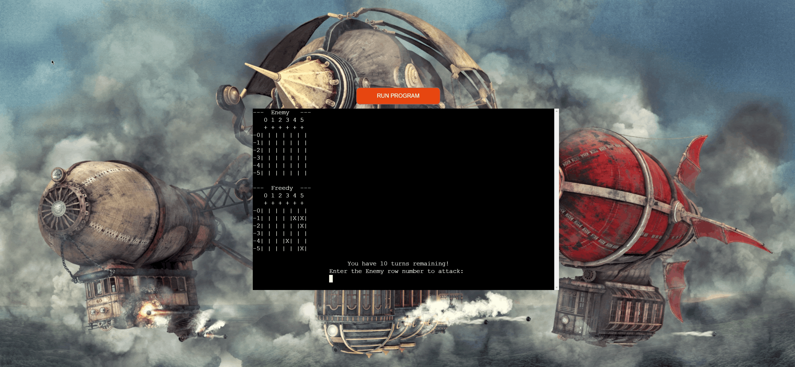

  - Show if Enemy airship was hit or missed, Show if Player airship was hit or missed and show how many turns left.
  

 

### **End messages** 
 - Message displayed upon a player's victory in the game.
  

 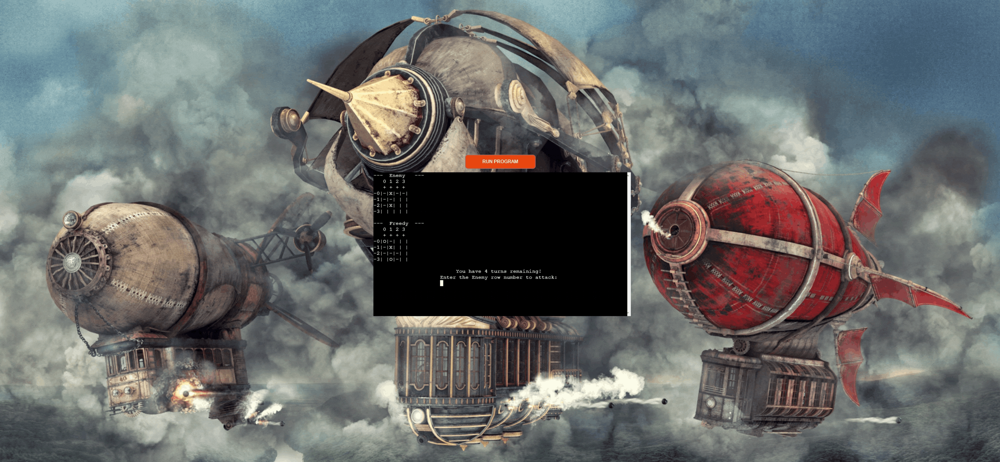

 - Message displayed upon a player's defeat in the game.
  

 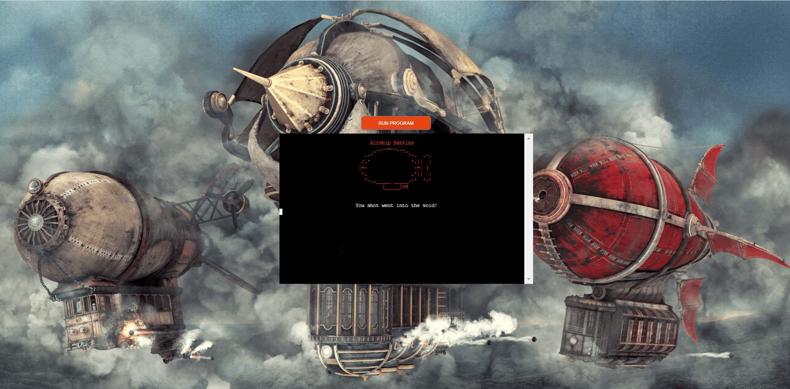

  - Message displayed upon a player's running out of turns.
  

 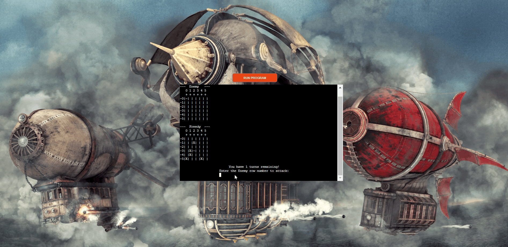

### **Restart**
 - Restarting message shown at the conclusion of the game.
  

 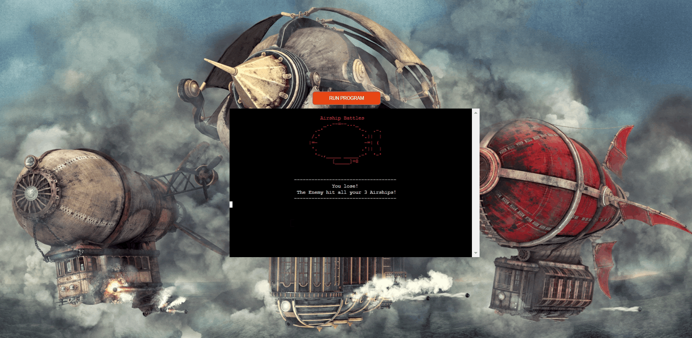

 

### **Front-end features**

 - Favicon icon
  

 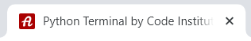

 - Page Title
  

 

 - Main Page Header
  

 

 - Youtube icon opening page in new tab
  
 
 

---

## **Future Implementations**
The author would like to implement random question order and add a lot more questions/answers/more knowledge. Also, give the user option to use various 'game modes' like easy, medium and hard and corresponding questions. Implement timer that the user can turn on/off for added challenge and more score points.

[Back to top ⇧](#space-quiz)

---

## **Technologies Used**

### **Languages Used**

- [HTML](https://en.wikipedia.org/wiki/HTML "Link to html Wikipedia page") - The website content was adjusted using HTML language.
- [CSS](https://en.wikipedia.org/wiki/CSS "Link to css Wikipedia page") - The webpage was styled using custom CSS internally using 'style' in the head of layout.html.
- [PYTHON](https://en.wikipedia.org/wiki/Python_(programming_language) "Link to Python Wikipedia page") - The project logic and operations inside CLI were developed using Python language.

### **Programs Used**

- [GitHub](https://github.com/ "Link to GitHub page") - Source code hosted on GitHub, deployed using Git Pages.
- [GitPod](https://www.gitpod.io/ "Link to GitPod page") - Used to commit, comment and push code during the development process.
- [Font Awesome](https://fontawesome.com/ "Link to Font Awesome page") - GitHub icon was obtained from Font Awesome.
- [Balsamiq](https://balsamiq.com/ "Link to Balsamiq page") - Used to create wireframes and website structure map for the project.
- [Visual Studio Code + Spell Checker add on](https://code.visualstudio.com/ "Link to Visual Studio page") - Used to spell-check the html and css code
- [Google Keep](https://keep.google.com/ "Link to Google Keep page") - Used to make notes during the project duration
- [LanguageTool](https://languagetool.org/ "Link to Language Tool page") - Used to spell-check the contents of README.md
- [Google Fonts](https://fonts.google.com/ "Link to Google fonts page") - Used to import fonts to the project
- [GifCap](https://gifcap.dev/ "Link to GifCap page") - used to capture gif-s of the project 
- [Heroku](https://www.heroku.com/ "Link to Heroku page") - used to deploy the project
- [XConvert](https://www.xconvert.com/compress-gif "Link to XConvert page") - used to compress GIF file
- [Imgur](https://imgur.com/ "Link to Imgur page") - used to host the background image and favicon
- [Patorjk](http://patorjk.com/software/taag/#p=display&f=Graffiti&t=Type%20Something%20 "Link to Patorjk page") - used to convert text into ASCII art
- [Google worksheet](https://www.google.com/sheets/about/ "Link to Google sheets page") - used to host the worksheet to hold data
- [Lucidchart](https://www.lucidchart.com/pages/examples/flowchart-maker "Link to Lucidchart page") - used to make the flowchart for the project

[Back to top ⇧](#space-quiz)

---

## **Deployment**
The project was written and hosted on [GitHub](https://github.com/ "Link to GitHub page"). The author used GitHub's terminal output with command 'python3 run.py' to run the program logic/game. After the project was developed enough, it was deployed on [Heroku](https://www.heroku.com/ "Link to Heroku page") using the following method:

1. Add dependencies in GitPod to requirements.txt file with command "pip3 freeze > requirements.txt"
2. Commit and push to GitHub
3. Go to the Heroku Dashboard
4. Click "Create new app"
5. Name app and select location
6. Add Config Vars for Creds and Port in Settings tab
7. Add the buildbacks to Python and NodeJS in that order
8. Select appropriate deployment method, GitHub
9. Connect to Github and link to repository
10. Enable automatic deployment and/or deploy manually
11. Click on Deploy

[Back to top ⇧](#space-quiz)

---

## **Testing**

Testing information can be found in a separate testing file [TESTING.md](/TESTING.md).

[Back to top ⇧](#space-quiz)

---

## **Credits**

### **Code used and adapted**

 - The author used his previous projects, [Boudoir Studio](https://boiann.github.io/boudoir-studio/index.html "Link to Boudoir Studio home page") ( GithHub repository [here](https://boiann.github.io/boudoir-studio/index.html "Link to Boudoir Studio home page") ), and [Budget Calculator](https://boiann.github.io/budget-calculator/ "Link to Budget Calculator") ( GithHub repository [here](https://github.com/Boiann/budget-calculator "Link to Budget Calculator GitHub repository") ) as a source for looking up the code for CSS and README purposes mainly.
 - [Code Institute template](https://github.com/Code-Institute-Org/python-essentials-template "Link to CI Python template") was used to start the project.
 - Using [Google worksheet](https://www.google.com/sheets/about/ "Link to Google sheets page") to manipulate questions and answers was seen during  Code Institute [Love Sandwiches](https://learn.codeinstitute.net/courses/course-v1:CodeInstitute+LS101+2021_T1/courseware/293ee9d8ff3542d3b877137ed81b9a5b/58d3e90f9a2043908c62f31e51c15deb/ "Link for Love Sandwiches project") project, ( GithHub repository [here](https://github.com/Code-Institute-Org/python-essentials-template "Link to CI Python template") ).
 - [Pub Quiz Challenge](https://pub-quiz-challenge.herokuapp.com/ "Link to Pub Quiz Challenge") ( GithHub repository [here](https://github.com/CI-Tom/pub-quiz-challenge "Pub Quiz Challenge repository page") ) was studied in depth to get a sense of how a quiz game in Python would work, and to get a sense of the quiz layout itself. It has also provided the solution for pairing the questions with the right answers.
 - [Football Quiz](https://football-quiz-game.herokuapp.com/ "Link to Football Quiz") ( GithHub repository [here](https://github.com/mikyrenato/3rd_Project_Quiz_Game "Football Quiz repository page") ) was taken note of because the CLI was centered and the image background was applied. This is also where the author learned about tabular display of the leaderboard.
 - [Wheel of Fortune](https://the-wheel-of-fortune.herokuapp.com/ "Link to Wheel of Fortune") ( GithHub repository [here](https://github.com/LudovicLeGuen/Wheel-of-Fortune "Wheel of Fortune repository page") ) was studied and this is where the author noticed and learned about clearing the screen in CLI.
 - [Harry Potter Adventure Game](https://harry-potter-adventure-game.herokuapp.com/ "Link to Harry Potter Adventure Game") ( GithHub repository [here](https://github.com/AlexaH88/harry-potter-adventure-game "Harry Potter Adventure Game repository page") ) was studied to fix the background issue in HTML, more on this in BUGS section in [TESTING.md](/TESTING.md).
 - [Carl Sagan quotes webpage](https://www.goodreads.com/author/quotes/10538.Carl_Sagan "Link to Carl Sagan quotes webpage") was used to copy Mr. Sagan's quotes for intro/outro.
 - [Space Trivia Questions](https://conversationstartersworld.com/trivia-questions/space-trivia-questions/ "Link to Space Trivia Questions") was where the author copied the questions, answers and 'more knowledge' info from.

### **Websites visited to gather knowledge**
There were many sites visited during the duration of the project.
[Google](https://google.com/ "Google home page") was used to produce results of the specific query, and [Stack Overflow](https://stackoverflow.com/ "Stack Overflow home page") proved to be the best source of information for various queries/issues. 

The standout webpages are:
- [This](https://stackoverflow.com/questions/5967500/how-to-correctly-sort-a-string-with-a-number-inside "Link to Sorting a string") website was used to learn about sorting a string.
 - [This](https://pypi.org/project/tabulate/ "Link to tabulate") website was used to learn about tabulating the leaderboard.
 - [This](https://www.geeksforgeeks.org/clear-screen-python/ "Link to sleep") website was used to learn about sleep.
 - [This](https://www.101computing.net/python-typing-text-effect/ "Link to typing print and clear screen") website was used to learn about typing print, input and clear screen.
 - [This](https://stackoverflow.com/questions/46112605/python3-issue-with-calling-execopen-read-inside-a-function "Link to restart program") website was used to learn about restarting the program.
 - [This](https://www.codingem.com/python-print-on-the-same-line/ "Link to print on the same line") website was used to learn about printing on a same line.

###  **Acknowledgments**
This whole project is dedicated to Carl Sagan, astronomer, planetary scientist, cosmologist, astrophysicist, astrobiologist, author, and science communicator.
His book 'Cosmos' inspired me as a child and geared me towards sciences and astronomy.

Without support I got from other people, this project would never be realized. I'll try and remember to thank everyone and everything I can!

- Mirjana, my wife, thank you for your support and cheering me on, lifting me 
back up when it got hard. Thank you for taking care of all the housework and food, children and numerous other responsibilities while I was busy with full time job and doing this project on the side. Without you this journey into career change would never be possible.
- A., G. and V., my three beautiful girls. Thank you for being so understanding during the project work. Thank you from the bottom of my heart for being who you are, wonderful and delightful souls. You make me proud to be your dad.
- Boris, my brother, thank you for testing my project so thoroughly, and for your support.
- Marija and Boris, my mother and father, thank you for making me feel like a superstar when I announced I'm starting this journey.
- John, my friend, thank you for starting me on this path, and for your support, chats and sharing the things you learned.
- Helen from Code Institute, thank you believing in me and making this change possible.
- Slack community, thank you for being a constant source of good information.
Special mentions are Sirinya_5P, Kate L_5P and Tomislav_5P, whose praise lifted my spirits and reinforced the notion that I can do this.
- Koko, my mentor, thank you for being an incredible source of solutions and good advice, your support meant a great deal during the project.
- C8H10N4O2 in a cup. Thank you for existing.

[Back to top ⇧](#space-quiz)

***