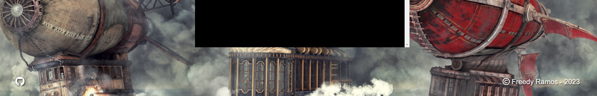

# Airship Battles

Airship Battles is a project created as part of the Code Institute Full-stack development program: Python Essentials - Project 3.   This project offers an exciting gaming experience centered around airship battles. Whether you're a fan of aerial adventures or gaming enthusiasts, Airship Battles is sure to captivate you with thrilling battles in the sky.

Visit the live site [Here.](https://pp3-airship.herokuapp.com/)

---

## CONTENTS

* [Project Overview](#project-overview)
  * [Project Goals](#project-goals)

* [User Experience](#user-experience)
  * [User Expectations](#user-expectations)
  * [User Stories](#user-stories)

* [Design](#design)
  * [Colour Scheme](#colour-scheme)
  * [Imagery](#imagery)
  * [Structure](#structure)

* [Features](#features)
  * [Background](#background)
  * [Name Input](#name-input)
  * [Grid Selection](#grid-selection)
  * [Board](#board)
  * [End Messages](#end-messages)
  * [Restart](#restart)
  * [Front-End Features](#front-end-features)

* [Future Implementations](#future-implementations)

* [Technologies Used](#technologies-used)
  * [Languages Used](#languages-used)
  * [Programs Used](#programs-used)

* [Deployment](#deployment)

* [Testing](#testing)

* [Credits](#credits)
  * [Code used and adapted](#code-used-and-adapted)
  * [Acknowledgments](#acknowledgments)

---

## **Project Overview**

I've been contemplating the 'Airship Battles' concept ever since I started the Code Institute Full-stack development program. When I finished the Python lessons, I was determined to turn this idea into a tangible project. I kicked off the project by creating wireframes and a flowchart to outline the gameplay and design.

The decision to dedicate this project was inspired by the themes of Final Fantasy airships, a beloved and iconic element of the Final Fantasy series.

"Airship Battles" stands out as a gaming project with a distinct set of features:

- **Error Checking Throughout**: The game is designed with robust error checking to ensure a smooth and seamless gaming experience.

- **Feedback on Every Input**: Players receive informative feedback for every action they take, whether it's the correct move or not, enhancing the learning process.

- **Evenly Spaced Text**: Text within the game is thoughtfully arranged to provide a visually pleasing and organized reading experience.

- **Typewriter-Style Text Output**: Enjoy an immersive typewriter-style text presentation, contributing to the overall atmosphere of the game.

- **Automatic Restart**: Begin a new game without needing to use a mouse at the end of the game.

- **Simplicity and Relaxation**: Immerse yourself in a straightforward and relaxing Airship-themed webpage, complementing the overall gaming experience.

These features were meticulously planned, with some being part of the initial project design (error checking and feedback), while others evolved organically as the project expanded in scope. The final result is a blend of elements aimed at delivering a captivating, enjoyable, and educational gaming experience.

### **Project Goals**

 - Create a command-line interface (CLI) game for airship battles using Python.
 - Design the game with a clear and intuitive interface.
 - Ensure an excellent user experience by focusing on layout, color schemes, and interaction.
 - Write reliable Python code, free from bugs and issues

[Back to top ⇧](#airship-battles)

---

## **User Experience**

### **User Expectations**

 - Easily understand the game's objective and mechanics.
 - Receive feedback for every interaction within the game.
 - Receive hints when facing challenges.
 - Access more information about ships damage, turns left, and outcomes (win, lose or out of turns).
 - Have the opportunity to add their name to the game.
 - Enjoy an appealing and thematically consistent visual design.
 - Encounter no errors or issues with the game's logic.

### **User Stories**

 - I want to have a nice background.
 - I want to have a username.
 - I want to be able to choose my grid.
 - I want to be able to see my name on the board.
 - I want to be shown help messages showing instructions.
 - I want to know more about the results of my selection.
 - I want to restart the game after finish playing.
 - I want no bugs or issues with the game.

[Back to top ⇧](#airship-battles)

---

## **Design**

### **Colour Scheme**

In the Airship Battles, the primary color is white, serving as the default for text. The ASCII image of the airship is red to enhance the theme, while answers and interactions maintain a plain and uncolored design for clarity and focus.

### **Imagery**

The Airship Battles features a simple design with a vast background picture, primarily designed to provide an immersive backdrop that complements the terminal game. This background picture serves to create a thematic atmosphere for the game, allowing players to focus on the CLI-based gaming experience without distractions.

 - Airships on the background
  

 

### **Structure**
 

The initial flowchart for the project was created at the project's inception. While the project generally adhered to the flowchart, there were some modifications made along the way to enhance the overall user experience (UX).

Flowchart Diagram

 

## **Features**

### **Background**
 - Background image showing a warship battle.
  

 

### **Name input**
 - Name input validation, success message, capitalize name.
  

 
 
 - Name input validation, error message.
  

 

### **Grid Selection**
 - Option to select a grid between 4 or 6 squares, with validation and help messages and success message.
  

 

### **Board**
 - Show Enemy board, Player Board with name input, Turns left and column and row input with error messages.
  

 

  - Show if Enemy airship was hit or missed, Show if Player airship was hit or missed and show how many turns left.
  

 

### **End messages** 
 - Message displayed upon a player's victory in the game.
  

 

 - Message displayed upon a player's defeat in the game.
  

 

  - Message displayed upon a player's running out of turns.
  

 

### **Restart**
 - Restarting message shown at the conclusion of the game.
  

 

 

### **Front-end features**

 - Favicon icon
  

 

 - Page Title
  

 

 - Main Page Header
  

 

 - Footer with Github icon opening page in new tab and copyright name
  
 
 

  

 [Back to top ⇧](#airship-battles)

---

## **Future Implementations**

To further enhance the "Airship Battles" game and provide an immersive gaming experience, the following features and improvements can be added in future updates:

1. **Difficulty Levels:** Implement different difficulty levels, such as "Novice," "Captain," and "Admiral," each with varying levels of challenge. Players can choose their preferred difficulty to test their strategic skills.

2. **Leaderboard:** Create a global leaderboard where players can compete for the top scores. This adds a competitive element to the game, motivating players to achieve high scores and top rankings.

3. **Expanded Grid Sizes:** Introduce additional grid sizes, such as "Small," "Medium," and "Large," each with its own set of airships and challenges. Players can select their desired grid size to vary the gameplay.

4. **Ships with Multiple Sizes:** Add airships of different sizes, including single-cell airships and larger ones that span multiple cells on the grid. This adds complexity to the game as players must strategically target and sink various-sized ships.

5. **Sound and Visual Effects:** Enhance the game's audio and visual effects with immersive soundtracks, animations for airship battles, and explosive effects when airships are sunk, making the gameplay more exciting and engaging.

6. **Option to Restart or Exit:** Provide players with the option to restart the game or exit to the main menu at any point during gameplay. This offers flexibility and convenience to players.

7. **Improved Visuals:** Enhance the overall visuals of the game, including background graphics, user interface elements, and airship designs. Improved visuals make the game more visually appealing.

These future implementations will elevate "Airship Battles" to the next level, offering players a more challenging and captivating gaming experience with options for customization, improved audio-visual elements, and the addition of airships with multiple sizes.

[Back to top ⇧](#airship-battles)

---

## **Technologies Used**

### **Languages Used**

- [HTML](https://en.wikipedia.org/wiki/HTML "Link to html Wikipedia page") - The website content was adjusted using HTML language.
- [CSS](https://en.wikipedia.org/wiki/CSS "Link to css Wikipedia page") - The webpage was styled using custom CSS internally using 'style' in the head of layout.html.
- [PYTHON](https://en.wikipedia.org/wiki/Python_(programming_language) "Link to Python Wikipedia page") - The project logic and operations inside CLI were developed using Python language.

### **Programs Used**

- [GitHub](https://github.com/ "Link to GitHub page") - Source code hosted on GitHub.
- [GitPod](https://www.gitpod.io/ "Link to GitPod page") - Used to commit, comment and push code during the development process.
- [Font Awesome](https://fontawesome.com/ "Link to Font Awesome page") - GitHub icon was obtained from Font Awesome.
- [GifCap](https://gifcap.dev/ "Link to GifCap page") - used to capture gif-s of the project .
- [Heroku](https://www.heroku.com/ "Link to Heroku page") - used to deploy the project.
- [Cloudinary](https://cloudinary.com/ "Link to Cloudinary") - used to host the background image and favicon
- [Lucidchart](https://www.lucidchart.com/pages/examples/flowchart-maker "Link to Lucidchart page") - used to make the flowchart for the project

[Back to top ⇧](#airship-battles)

---

## **Deployment**
The project was written and hosted on [GitHub](https://github.com/ "Link to GitHub page"). The author used GitHub's terminal output with the command `python3 run.py` to run the program logic/game. After the project was developed sufficiently, it was deployed on [Heroku](https://www.heroku.com/ "Link to Heroku page") using the following method:

1. Add dependencies in GitPod to requirements.txt file with command "pip3 freeze > requirements.txt"
2. Commit and push to GitHub
3. Go to the Heroku Dashboard
4. Click "Create new app"
5. Name app and select location
6. Add Config Vars for Creds and Port in Settings tab
7. Add the buildbacks to Python and NodeJS in that order
8. Select appropriate deployment method, GitHub
9. Connect to Github and link to repository
10. Enable automatic deployment and/or deploy manually
11. Click on Deploy

[Back to top ⇧](#airship-battles)

---

## **Testing**

Testing information can be found in a separate testing file [TESTING.md](/TESTING.md).

[Back to top ⇧](#airship-battles)

---

## **Credits**

### **Code used and adapted**

- The author used [Space Quiz](https://github.com/Boiann/space-quiz) from [Boiann Github](https://github.com/Boiann) as the basis for layouts and index templates.

- The author used [Space Quiz](https://github.com/Boiann/space-quiz) from [Boiann Github](https://github.com/Boiann) as the basis for README and TESTING templates.

- The author used [Battleship](https://github.com/gbrough/battleship) from [Garrett Github](https://github.com/gbrough) as the basis for the logic in run.py templates.

### **Image Used**

- The author used [Airship Background](https://dronnnnn95.artstation.com/projects/D682E) from [Andrii Yermolenko](https://dronnnnn95.artstation.com/) as the background image.

- The author used [Airship ASCII](https://www.ascii-art.de/ascii/xyz/zeppelin.txt) from [ASCII Art](https://www.ascii-art.de/) as header ASCII image.

### **Websites visited to gather knowledge**

There were many sites visited during the duration of the project.

[Google](https://google.com/ "Google home page") was used to produce results of the specific query, and [Stack Overflow](https://stackoverflow.com/ "Stack Overflow home page") proved to be the best source of information for various queries/issues. 

The standout webpages are:
 - [geeksforgeeks](https://www.geeksforgeeks.org/clear-screen-python/ "Link to clear screen") website was used to learn about clear screen.
 - [Open AI](https://openai.com/chatgpt "Link to open AI screen")  AI-powered language model - for general purpose queries. 

###  **Acknowledgments**

- To Code Institute for the support and attention.
- My heartfelt thanks to my amazing wife, Marcielly, for her constant support and encouragement during the entire project.

[Back to top ⇧](#airship-battles)

***