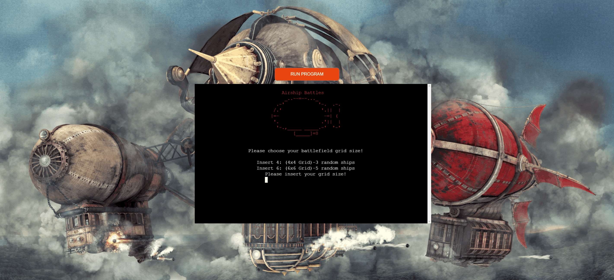
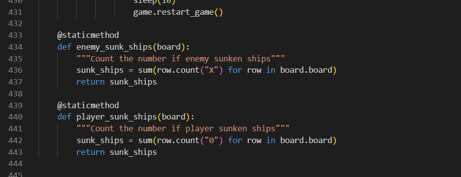

# **Airship Battles - Testing** 

[Main README.md file](/README.md)

Visit the live site [Here.](https://pp3-airship.herokuapp.com/)

[GitHub Repository](https://github.com/Freedy-FR/CI-P3-Airship "Link to GitHub Repository")

---
## **Contents**
* [Automated Testing](#automated-testing)

* [Manual Testing](#manual-testing)
  * [Testing User Stories](#testing-user-stories)
  * [Full Testing](#full-testing)

* [Bugs](#bugs)
  * [Known Bugs](#known-bugs)
  * [Solved Bugs](#solved-bugs)

---

## Automated Testing

The [CI Python Linter](https://pep8ci.herokuapp.com/) service was used to validate the Python code used, showing no errors.

[Back to top ⇧](#airship-battles---testing)

---

## **Manual Testing**

### **Testing User Stories**

* **I want to have a nice background.**

    - The page has an appealing airship-themed background, making it clear that it's an airship-themed battle game.

* **I want to have a username.**

    - The user can enter a username without restrictions on character types, allowing the use of any characters and numbers, with character limits between 1 and 6.

* **I want to be able to choose my grid.**

    - The user has the option to choose between two grid sizes:
      - Insert 4: (4x4 Grid) - This grid contains 3 random ships.
      - Insert 6: (6x6 Grid) - This grid contains 5 random ships.

* **I want to be able to see my name on the board.**

    - The user's name is clearly displayed at the top of the airship battle grid.

* **I want to be shown help messages showing instructions.**

    - Validation or instructions are provided to guide the user in the airship battle game inputs.

* **I want to know more about the results of my selection.**

    - Information is available to explain the results of the user's selections in the airship battle game.

* **I want to restart the airship battle game after finishing playing.**

    - The game restart automatically after completion or when the game is over.

* **I want no bugs or issues with the airship battle game.**

    - The application handles user inputs gracefully, providing feedback and avoiding issues in the airship battle game.

### **Full Testing**

Manual testing was done mainly by the author. The code was ran in GitPod terminal over and over for bug checking, loops and functions performance and UX considerations. At later stage it was thoroughly tested after deployment on Heroku. More about in [Bugs](#bugs) section of this readme file.

Testing present features:

 - Background screen
  

 

 - Name input success, capitalize name
  

 
 
 - Name input errors
  

 

 - Show player name on the board
  

 

 - Help messages showing instructions.
  

 

  

 

  

 

 - Board selection Status
  

 

 - Game over and Restart
  

 

 - Duplicated input on the board.
  

 

 - GitHub icon opening page in new tab
  

 

---

## **Bugs**

### **Known Bugs**

- There is a sporadic bug on the deployed project where some of the top displays of the console get duplicated. This issue occurs intermittently, and the cause has not yet been identified.It's worth noting that the console must be scrolled up for the bug to be noticed.

### **Solved Bugs**

There were many 'small' bugs the author had to deal with during the development of the project. Most of them were squashed by doing a quick [Google](https://google.com/ "Google home page") search and using [Stack Overflow](https://stackoverflow.com/ "Stack Overflow home page") to find relevant solutions or querying [OpenAI](https://chat.openai.com/ "OpenAI").

- Not so much a bug, but there was a typo that affected the count of player-sunk ships. Instead of using "O" to check the count, "0" (zero) was mistakenly used, creating a condition that didn't count the number of player-sunk ships correctly, effectively making the player invincible. The issue has been resolved in the code below.

    *Before*
     

    
     

    *After*
     
    
    
     

[Back to top ⇧](#airship-battles---testing)